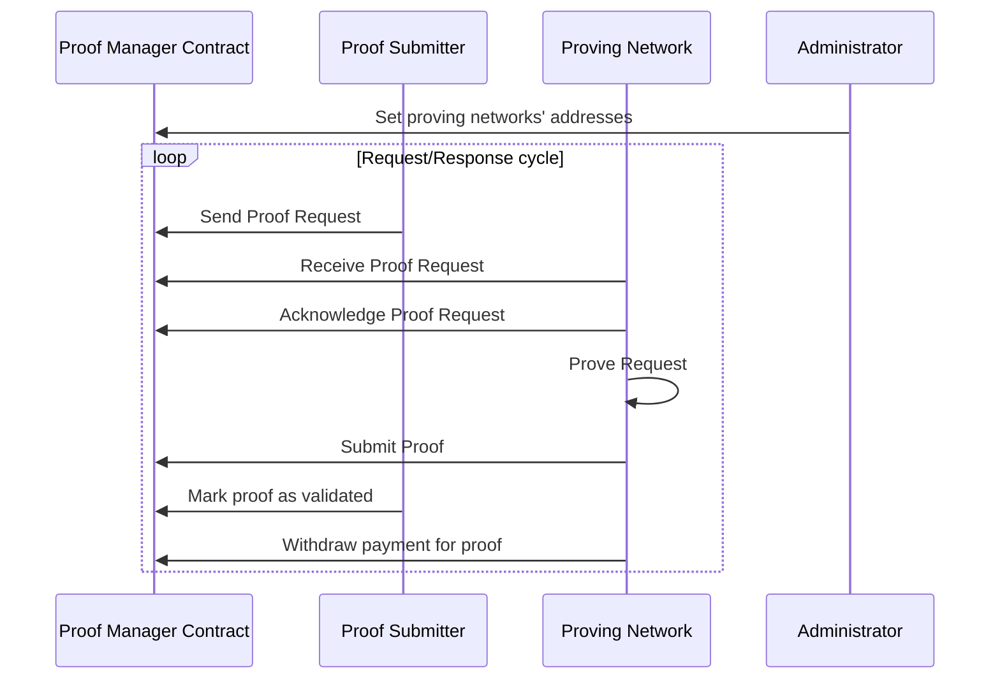

# proof-manager-contracts

Proof Manager is a smart contract that distributes proofs for [zksync-era](https://github.com/matter-labs/zksync-era)'s batches to specific set of proving networks. Amongst the first integrating proving networks, there are [Fermah](https://www.fermah.xyz/) and [Lagrange](https://www.lagrange.dev/).

## Design

The smart contract is meant as a store and source of truth for proof distribution. External actors (such as administrator, proof submitter and proving network) need to interact with the contract to have the workflow going. The general flow as follows:



> NOTE: Proof Submitter and Admin share the same account, but fulfill different roles.

### Actors

**Administrator** - other than deploying the smart contract, administrator can:

- change addresses for proving networks (for instance, during key rotation or in case of hacked keys)
- mark networks as active/inactive (for instance, if a proving network is having an outage or for some reason does not want to receive requests)
- set the preferred network.

> NOTE: Preferred Network is a network that will receive a bulk (currently set at 50%) of proofs based on performance. This performance is evaluated on a monthly basis based on external component that will audit the on-chain traffic. This component will be open source and can be run by anyone else.

**Proof Submitter** - submits proof requests and can transition proofs through a few stages, namely:

1. from proof request being `PendingAcknowledgement` to `Unacknowledged` (when acknowledgement deadline passed)
2. from proof request being `Committed` to `TimedOut` (when proof generation deadline passed)
3. from proof request being `Proven` to `Validated` (when the proof received from proving network has been validated on settlement layer)

A proof submitter will listen for events emitted when the proof request switches states from `Committed` to `Proven` so it can take the proof and push it to sequencer (which will submit it to settlement layer).

> NOTE: For more details on proof request states, see [this section](#proof-request-state-machine).

**Proving Network** - actions are scoped to their assigned

- acknowledges proof request (needs to be done within 2 minutes of submissions, either to commit proving the request or refuse proving altogether); this action will mark the request from `PendingAcknowledgement` to `Committed`/`Refused`
- submits proof once the proof is ready and before deadline (set at proof submission time); this action will mark the request from `Committed` to `Proven`
- withdraws funds for `Validated` proofs; this action will mark all requests for the given network from `Validated` to `Paid`

A proving network will listen for events emitted at proof submission to acknowledge the proof (either committing or refusing to prove) and submit proofs within the deadline (as read during acknowledgement phase). The proving network is free to withdraw its funds at any time it finds convenient, with the limitation that no more than 25k USDC can be withdrawn at any given time. In order to understand when the funds are ready, the proving network can either read the provingNetworkInfo associated with its network or listen for `Validated` events and tally up the sum.

## Proof Assignment

This is a round-robin, hard-coded in the contract logic. The round robin is 25%, out of 4 proofs, Fermah will get 1 proof, Lagrange another and the last 2 go to the Preferred Network.
In case of inactivity, proofs are marked as `Declined` by the Proof Manager.

## Proof Request State Machine

Proof Requests have the following state machine:

```
PendingAcknowledgement // when a proof request is submitted
Committed // when a proving network commits to generating a proof
Refused // when a proving network refuses to prove a request or the network is inactive at assignment time
Unacknowledged // when a proving network failed to acknowledge a proof request in the acknowledgement deadline
Proven // when a proving network has submitted a proof for a request it has committed to prove
TimedOut // when a proving network failed to submit a proof for a request it has committed to prove
Validated // when sequencer knows that the proof provided by proving network has been validated on L1
ValidationFailed // when the sequencer knows that the proof provided by proving network failed validation on L1
Paid // when the proving network withdraws funds
```

Status transitions:

```
            +--> [Refused]
            |
[PendingAcknowledgement] ----+-----> [Unacknowledged]
            |
            +--> [Committed] --> [TimedOut]
                            |
                            +--> [Proven] --> [ValidationFailed]
                                        |
                                        +--> [Validated] --> [Paid]
```

## How to run

### Prerequisites
You need to have foundry installed. Please refer to their [guide](https://book.getfoundry.sh/getting-started/installation) for installation.

## Deployment

To deploy contracts you have to enter `scripts/deploy.sh` file and adjust the environmental variables to your needs.
After that you can simply run 
```shell
./scripts/deploy.sh
```

## FAQs

**1. What happens with the proofs that are `Refused`/`Unacknowledged`/`TimedOut`/`ValidationFailed`?**
A: The sequencer is responsible for noticing and generating the proofs in a manner it finds fit, that does not depend on Proving Networks. The default setup is to delegate to a centralized, internal prover subsystem.

## License

ZKsync Era proof manager contracts are distributed under the terms of the MIT license.

See [LICENSE-MIT](./LICENSE-MIT) for details.

## Official Links

- [Website](https://zksync.io/)
- [GitHub](https://github.com/matter-labs)
- [ZK Credo](https://github.com/zksync/credo)
- [Twitter](https://twitter.com/zksync)
- [Twitter for Devs](https://twitter.com/zkSyncDevs)
- [Discord](https://join.zksync.dev/)
- [Mirror](https://zksync.mirror.xyz/)

## Disclaimer

ZKsync Era has been through lots of testing and audits. Although it is live, it is still in alpha state and will go through more audits and bug bounties programs. We would love to hear our community's thoughts and suggestions about it! It is important to state that forking it now can potentially lead to missing important security updates, critical features, and performance improvements.
